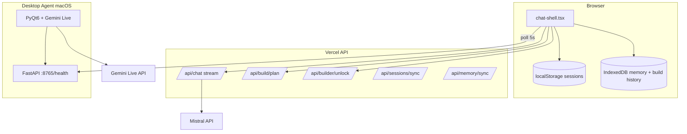

# JARVIS — Chat, Builder & Desktop Voice Agent

**Monorepo:** Next.js 16 web app + Python desktop voice agent (Gemini Live)  
**Produkcia:** https://jarvis-ten-omega.vercel.app/chat  
**GitHub:** https://github.com/youh4ck3dme/jarvis-chat-main  
**Lokálny dev:** http://127.0.0.1:3141/chat  
**Linear backlog:** `pnpm linear:sync` (vyžaduje `LINEAR_API_KEY`)

---

## Obsah

1. [Čo je JARVIS](#čo-je-jarvis)
2. [Rýchly štart](#rýchly-štart)
3. [Developer Guide](#developer-guide)
4. [Architektúra](#architektúra)
5. [Environment](#environment)
6. [Operácie & CI](#operácie--ci)
7. [Desktop Voice Agent](#desktop-voice-agent)
8. [Testovanie](#testovanie)
9. [Backlog & roadmap](#backlog--roadmap)
10. [Linear sync](#linear-sync)

---

## Čo je JARVIS

| Komponent | Popis |
|-----------|--------|
| **Web Chat** | Konverzácia s Mistral (default), multi-session, pamäť |
| **Builder** | Landing page pipeline — planner → stream → evaluator → refine |
| **Desktop Voice** | macOS PyQt6 + Gemini Live, 18 nástrojov, health bridge `:8765` |
| **Cloud sync** | Supabase auth + sessions/memory sync (voliteľné) |

**Nie je:** Postgres chat DB, OpenRouter routing, Supabase Edge Functions.

**Default model:** `mistral/mistral-small-latest`  
**Builder heslo:** nastav `BUILDER_UNLOCK_PASSWORD` v `.env.local` (lokálne) a vo Vercel env (produkcia) — nikdy do gitu.

---

## Rýchly štart

### Web

```bash
cd /Users/erikbabcan/HUB/JARVIS/jarvis-chat-main
cp .env.example .env.local    # doplň MISTRAL_API_KEY
pnpm install
pnpm dev                      # http://127.0.0.1:3141/chat
```

### Desktop Voice (macOS)

```bash
brew install portaudio
pnpm desktop:setup
pnpm desktop:gen-config
pnpm desktop:sync-prompt

# Spustenie — NIKDY `python main.py` (systémový Python nemá deps)
pnpm desktop:run
# alebo dvojklik: ~/Applications/JARVIS.app  (po `pnpm desktop:app`)
```

### Overenie stacku

```bash
pnpm desktop:stack      # :8765 + :3141
pnpm desktop:health     # JSON z desktop agenta
pnpm desktop:voice-smoke
pnpm test
```

---

## Developer Guide

### Štruktúra repozitára

```
jarvis-chat-main/
├── app/                    # Next.js App Router + API routes
├── components/
│   ├── chat/               # chat-shell, composer, message-list
│   └── workspace/          # header, footer, preview, voice panel
├── lib/
│   ├── agents/             # planner, evaluator, orchestrator
│   ├── chat/               # build-pipeline, sessions, story
│   ├── memory/             # IndexedDB + cloud sync
│   └── desktop-agent/      # health client, polling context
├── desktop-agent/          # Python Gemini Live + PyQt6
│   ├── main.py             # Live session + tools
│   ├── bridge/             # FastAPI health :8765
│   ├── actions/            # 18 macOS tools
│   └── jarvis_voice.py     # Schedar + EN/SK alternation
├── shared/
│   ├── tool-manifest.json  # 18 tools (web + desktop)
│   └── jarvis-core-prompt.txt
├── scripts/                # E2E, Linear sync, icons, audit
├── e2e/                    # Playwright iPhone tests
└── docs/                   # detailné appendixy (architektúra, ops)
```

### Kľúčové moduly

| Modul | Súbor | Úloha |
|-------|-------|-------|
| UI orchestrátor | `components/chat/chat-shell.tsx` | Sessions, stream, builder pipeline |
| Build flow | `lib/chat/build-pipeline.ts` | Pure TS — planner → stream → refine |
| HTML repair | `copied-from-visual-html/lib/jarvis-artifacts.ts` | Auto-oprava useknutého HTML |
| Sessions | `lib/chat/chat-sessions.ts` | localStorage multi-chat |
| Memory | `lib/memory/` | IndexedDB per `conversationId` |
| Desktop poll | `lib/desktop-agent/use-desktop-agent.ts` | Health každých 5s |

### Režimy: Chat vs Builder

| Režim | Správanie |
|-------|-----------|
| **Chat** | Konverzácia, žiadny auto-build |
| **Builder** | Po unlock → planner + HTML stream + live preview |

Unlock: `POST /api/builder/unlock` — heslo len na serveri (`BUILDER_UNLOCK_PASSWORD`).

Build intent v Chat móde (heslo OK): auto-planner + story beats.

### Build pipeline

```
User prompt → Planner (Mistral JSON) → Builder stream (/api/chat)
  → evaluateBuildArtifact + evaluateMobileReadiness
  → repairJarvisHtmlArtifact (auto-fix)
  → refine max 2× ak shouldRefine
  → Live Preview + telemetry
```

**Stream fix:** RAF-throttled message updates, skip persist počas `isStreaming`.

### Story beats (`lib/chat/jarvis-story.ts`)

| Beat | Trigger |
|------|---------|
| Opening | Prázdna konverzácia |
| 45s nudge | Idle v Chat |
| Build intent | „rozložím v hlave…" |
| Plan ready | „Teraz kódujem…" |
| Build success | „Hotovo…" |

### Coding conventions

- TypeScript strict, Vitest pre unit/integration
- API envelope: `lib/api-response.ts` — `{ success, data?, error? }`
- Desktop Python: vždy `.venv/bin/python`, nie systémový `python`
- Commity na `main` → Vercel auto-deploy + GitHub CI

### Užitočné príkazy

```bash
pnpm dev                      # web :3141
pnpm build                    # production build
pnpm test                     # Vitest (~260 testov)
pnpm test:e2e:iphone          # Playwright iPhone
pnpm test:all                 # oboje
pnpm audit:vercel-env:full    # env audit + Vercel CLI
pnpm smoke:mistral            # live Mistral probe
pnpm icons:generate           # PWA + desktop ikony
pnpm desktop:app              # macOS JARVIS.app → ~/Applications
pnpm linear:sync              # backlog → Linear
```

---

## Architektúra



### API routes

| Route | Method | Popis |
|-------|--------|-------|
| `/api/chat` | POST | Text stream |
| `/api/build/plan` | POST | Planner JSON |
| `/api/builder/unlock` | POST | Builder unlock (rate limited) |
| `/api/memory/sync` | GET/POST | Cloud memory |
| `/api/sessions/sync` | GET/POST | Cloud sessions |
| `/api/desktop-agent/status` | GET | Proxy status (optional) |

### Mobile (iPhone 17 Air)

- Viewport: **420×912** CSS px, `viewport-fit: cover`
- Auto-switch na artifact počas buildu na mobile
- `@media (max-width: 768px)` v HTML evaluátore
- Testy: `pnpm test:iphone`, `pnpm test:e2e:iphone`

Detail: [`docs/architecture.md`](docs/architecture.md)

---

## Environment

Šablóna: `.env.example` → `.env.local` (gitignored)

### Povinné (produkcia)

| Premenná | Popis |
|----------|--------|
| `MISTRAL_API_KEY` | Planner + chat stream |
| `BUILDER_UNLOCK_PASSWORD` | Server only — **nikdy** `NEXT_PUBLIC_` |

### Odporúčané

| Premenná | Default |
|----------|---------|
| `DEFAULT_AI_MODEL` | `mistral/mistral-small-latest` |
| `NEXT_PUBLIC_DEFAULT_AI_MODEL` | rovnaký |

### Supabase (cloud sync)

| Premenná | Popis |
|----------|--------|
| `NEXT_PUBLIC_SUPABASE_URL` | Auth + client |
| `NEXT_PUBLIC_SUPABASE_ANON_KEY` | Auth |
| `SUPABASE_SERVICE_ROLE_KEY` | Server sync API |

### Desktop agent

| Premenná | Popis |
|----------|--------|
| `GEMINI_API_KEY` | Gemini Live hlas |
| `MISTRAL_API_KEY` | Desktop text tools |
| `DESKTOP_AGENT_VOICE` | default `Schedar` |
| `DESKTOP_AGENT_MACOS_TTS_VOICE` | default `Daniel` |

### Linear sync

| Premenná | Popis |
|----------|--------|
| `LINEAR_API_KEY` | Personal API key |
| `LINEAR_TEAM_ID` alebo `LINEAR_TEAM_KEY` | Team |

Detail: [`docs/environment.md`](docs/environment.md)

---

## Operácie & CI

### Deploy

```bash
git push origin main   # → Vercel auto-deploy
```

### CI (`.github/workflows/ci.yml`)

```
test (Vitest + tsc) → e2e-iphone → build → lint
```

| Workflow | Účel |
|----------|------|
| `ci.yml` | Hlavný pipeline |
| `desktop-agent.yml` | Python tests |
| `vercel-env-audit.yml` | Mesačný env audit |
| `mistral-smoke.yml` | Týždenný Mistral probe |

### Troubleshooting

| Problém | Riešenie |
|---------|----------|
| Builder 503 | Chýba `BUILDER_UNLOCK_PASSWORD` na Vercel |
| Stream loop error | Aktualizuj na latest `main` (RAF fix) |
| `:8765` failed | Spusti `pnpm desktop:run` alebo `JARVIS.app` |
| `sounddevice` missing | Použi `./run.sh`, nie `python main.py` |
| Memory sync | Export `desktop-auth.json` po magic link login |

Detail: [`docs/operations.md`](docs/operations.md)

---

## Desktop Voice Agent

### Hlas — Iron Man JARVIS

| Kanál | Nastavenie |
|-------|------------|
| Gemini Live | **Schedar** (even, calm) |
| macOS `say` | **Daniel** (British) |
| Reč | Každé **2. slovo SK**, nepárne EN (audio odpovede) |

```bash
pnpm desktop:voice-smoke
```

### macOS app

```bash
pnpm desktop:app
open ~/Applications/JARVIS.app
```

### Auth export (memory sync)

1. Prihlás sa v `/chat` (magic link)
2. Menu → **Stiahnuť desktop-auth.json**
3. Ulož do `~/.jarvis/desktop-auth.json`
4. Reštartuj desktop agenta

### 18 macOS tools

Definované v `shared/tool-manifest.json` — `open_app`, `web_search`, `screen_process`, `agent_task`, …

Detail: [`docs/desktop-agent.md`](docs/desktop-agent.md)

---

## Testovanie

| Príkaz | Čo overí |
|--------|----------|
| `pnpm test` | ~260 Vitest unit/integration |
| `pnpm test:iphone` | Vitest responsive 420px |
| `pnpm test:e2e:iphone` | Playwright layout + build handoff |
| `pnpm test:all` | Vitest + E2E |
| `pnpm desktop:voice-smoke` | Hlas + prompt + bridge.json |
| `cd desktop-agent && make test` | Python pytest |

```bash
# Playwright layout snapshot update
pnpm test:e2e:update-layout-snapshots
```

---

## Backlog & roadmap

### ✅ Hotové (výber)

- P1–P21: chat, builder, sessions, memory, CI, PWA
- Desktop Voice: Gemini Live, 18 tools, health bridge, memory E2E
- Stream fix (update depth), HTML auto-repair
- Iron Man voice Schedar + EN/SK alternation
- macOS `JARVIS.app`, rate limiting unlock, Vercel env audit

### 🔧 Otvorené úlohy

| Priorita | Úloha |
|----------|--------|
| P2 | Commit + deploy JARVIS ikon (PWA) |
| P2 | Auth export `refresh_token` |
| P2 | PyQt6 setup → Mistral namiesto OpenRouter |
| P3 | OAuth Google/GitHub |
| P3 | Globálny memory search |
| P3 | Voice panel bez Supabase env |
| P4 | Real-device Safari E2E |
| P4 | Batch eval / continuous monitoring |

### 💥 Bomba nápady (Builder P2/P3)

Nezávislé slice-y pre ďalšiu generáciu Builder UX. Každý sa dá dodať samostatne — žiadny neporušuje existujúci sandbox model (`allow-scripts` + CSP) ani nezavádza server dependency.

#### 1. Diff-based Snapshot Timeline s vizuálnym A/B preview

- **Čo:** Horizontálna time-lane so screenshotom každého snapshotu; hover = mini-preview; klik = split-view „before vs after“ so zvýraznenými zmenami.
- **Prečo je to 8× lepšie:** Namiesto plochého zoznamu build histórie (dnes len prompt + score v `workspace-menu-drawer.tsx`) okamžite vidíš, čo AI naozaj zmenila — aj keď `handleSelectBuildRecord` dnes obnoví len telemetry, nie HTML.
- **Ako to postaviť (skratka):**
  - Rozšíriť IndexedDB store (`JarvisBuildHistory` v3 alebo nový `JarvisSnapshots`) o `html` + `thumbnailBlob` (ring-buffer 50 už existuje v `trimBuildHistoryForSession`)
  - Po úspešnom builde: uložiť HTML + `html2canvas` thumbnail do blob store
  - Prepojiť dormant `JarvisDeckSnapshot` + `diffJarvisText()` z `copied-from-visual-html/lib/jarvis-workspace.ts`; vizuálny DOM diff cez `diff-dom`
  - Nový komponent `components/workspace/snapshot-timeline.tsx`; wire `isViewingSnapshot` / `onBackToLive` v `components/chat/chat-shell.tsx`
  - **Deps:** `html2canvas`, `diff-dom`

#### 2. Prompt-to-Component Library (local RAG)

- **Čo:** Pinované „úspešné“ snapshoty sa indexujú do lokálneho embedding indexu; pri novom prompte Jarvis pošle top-3 podobné artefakty ako few-shot examples.
- **Prečo je to 8× lepšie:** Každý ďalší build stojí na overených vzoroch — bez cloudu, 100 % v browseri; compounding learning namiesto čistého zero-shot.
- **Ako to postaviť (skratka):**
  - Pin akcia na snapshot timeline (závisí na #1 pre HTML storage)
  - Nový modul `lib/rag/local-embedding-index.ts` — `@xenova/transformers` MiniLM, embeddings v IndexedDB (`JarvisComponentLibrary` store)
  - V `lib/chat/build-pipeline.ts` pred planner fázou: `retrieveTopK(prompt, 3)` → inject do system/few-shot kontextu
  - UI: pin/unpin ikona na timeline karte
  - **Deps:** `@xenova/transformers` (lazy-loaded Web Worker)

#### 3. Multi-Artifact Workspace (mini „pages“)

- **Čo:** Session s viacerými HTML artefaktmi (index, about, pricing) prepínateľnými tabmi v preview + auto-linking medzi stránkami cez srcdoc postMessage router. Export = ZIP s viacerými `.html`.
- **Prečo je to 8× lepšie:** Z one-shot landing page buildera sa stáva reálny statický site generator — viacstránkové projekty bez opakovania celého flow.
- **Ako to postaviť (skratka):**
  - Rozšíriť `ChatSession` v `lib/chat/chat-sessions.ts` o `artifacts: { id, slug, title, html, createdAt }[]` (migrácia: existujúci latest HTML → `artifacts[0]`)
  - Tab bar v `copied-from-visual-html/components/jarvis/jarvis-preview-panel.tsx` alebo nový `artifact-tabs.tsx`
  - `lib/artifact-router.ts` — parent→child postMessage: intercept `<a href>` v sandboxe, prepnúť tab namiesto navigácie mimo iframe
  - Rozšíriť `lib/chat/project-zip-export.ts`: `index.html`, `about.html`, … + aktualizovaný `manifest.json`
  - Builder prompt parsing: detekcia viacerých ` ```html ` blokov s `<!-- page:about -->` anotáciou

#### 4. Sandbox Runtime Inspector (Console + Network overlay)

- **Čo:** Dev-agent injektovaný do sandbox iframe → panel v Jarvis UI zobrazuje `console.*`, uncaught errors, fetch/XHR a performance markery.
- **Prečo je to 8× lepšie:** Užívateľ vidí broken script, 404, CSP violation priamo v appke — bez DevTools a bez opúšťania workspace.
- **Ako to postaviť (skratka):**
  - Wire existujúce `onConsoleEntry` / `onNavigationEntry` props v `components/chat/chat-shell.tsx` (infra už v `jarvis-preview-panel.tsx`)
  - Rozšíriť `PREVIEW_CONSOLE_BRIDGE_SCRIPT` v `copied-from-visual-html/lib/preview-console-bridge.ts`: `window.onerror`, `unhandledrejection`, monkey-patch `fetch`/`XMLHttpRequest`, `performance.mark`/`measure`
  - Nový `components/workspace/runtime-inspector-panel.tsx` — záložka vedľa Preview/Code v `components/workspace/workspace-footer.tsx`
  - Pridať `event.origin` validáciu na parent listener (security hardening)
  - Feed do `JarvisBehaviorEvent` typu `"console"` / `"navigation"` pre budúci deck export

#### 5. „Fix it“ self-heal loop

- **Čo:** Pri runtime error alebo CSP violation → one-click „Ask Jarvis to fix“ → chyba + HTML slice späť do modelu → nahradí artefakt + auto-snapshot. Retry limit 3.
- **Prečo je to 8× lepšie:** Zatvára loop chat → build → validate → fix, ktorý dnes musí robiť človek manuálne kopírovaním chyby do chatu.
- **Ako to postaviť (skratka):**
  - **Závisí na #4** (inspector musí zachytiť chybu)
  - V `runtime-inspector-panel.tsx`: tlačidlo „Fix it“ pri error riadku
  - `lib/chat/self-heal.ts` — zostaví follow-up prompt: error stack + relevantný HTML slice (okolo `<script>` alebo failing elementu)
  - Volá existujúci build flow v `components/chat/chat-shell.tsx` s `retryCount` state (max 3)
  - Po úspechu: auto-uloží snapshot (#1) a reset retry counter
  - UI indikátor: „Self-heal attempt 2/3“

| # | Nápad | Priorita | Závislosti | Kľúčové súbory |
|---|-------|----------|------------|----------------|
| 1 | Snapshot Timeline | P2 | — | `build-history-store.ts`, `jarvis-workspace.ts`, `snapshot-timeline.tsx` |
| 2 | Local RAG | P2 | #1 (pin + HTML) | `local-embedding-index.ts`, `build-pipeline.ts` |
| 3 | Multi-Artifact | P2 | — | `chat-sessions.ts`, `project-zip-export.ts` |
| 4 | Runtime Inspector | P3 | — | `preview-console-bridge.ts`, `chat-shell.tsx` |
| 5 | Fix-it loop | P3 | #4 | `self-heal.ts`, `chat-shell.tsx` |

#1, #3 a #4 sú nezávislé a môžu ísť paralelne. #2 potrebuje HTML storage z #1. #5 potrebuje inspector z #4.

Kompletný zoznam: [`scripts/linear-backlog.json`](scripts/linear-backlog.json)  
Stav projektu: [`todo.md`](todo.md)

---

## Linear sync

| Súbor | Účel |
|-------|------|
| `scripts/linear-backlog.json` | 20 zdokumentovaných issues |
| `scripts/linear.config.json` | Stabilné URL (team **YOU**, workspace youh4ck3dme) |
| `.env.local` | `LINEAR_API_KEY` (gitignored) |

**Board:** https://linear.app/youh4ck3dme/team/YOU  
**API keys:** https://linear.app/settings/api

```bash
# .env.local
LINEAR_API_KEY=lin_api_...
LINEAR_TEAM_KEY=YOU

pnpm linear:status      # overí pripojenie + koľko issues je synced
pnpm linear:sync:dry    # náhľad bez API
pnpm linear:sync        # vytvorí len chýbajúce issues (idempotentné)
```

Existujúce issues (rovnaký title) sa preskočia. Pri 429 rate limit script retryuje.

---

## Dokumentácia (appendix)

| Súbor | Obsah |
|-------|--------|
| [`developer.md`](developer.md) | Odkaz na tento README |
| [`docs/architecture.md`](docs/architecture.md) | Pipeline detail + mermaid |
| [`docs/environment.md`](docs/environment.md) | Vercel env komplet |
| [`docs/operations.md`](docs/operations.md) | Deploy, CI, troubleshoot |
| [`docs/desktop-agent.md`](docs/desktop-agent.md) | Voice agent setup |
| [`todo.md`](todo.md) | Backlog snapshot |

---

## Licencia & pôvod

Next.js projekt bootstrapped with [v0](https://v0.app).  
Desktop agent: PandoRa-Box / Jarvis monorepo.

**v0 projekt:** https://v0.app/chat/projects/prj_IaeH72i5mp4HYmF42VaSbiiyRYKx