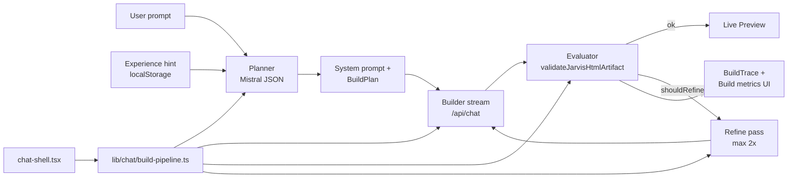

# Jarvis Build Architecture

**Project:** `/Users/erikbabcan/HUB/JARVIS/jarvis-chat-main`  
**Production:** https://jarvis-ten-omega.vercel.app/chat  
**Model:** `mistral/mistral-small-latest` via `MISTRAL_API_KEY`

## Build pipeline



## Chat orchestration layer

`lib/chat/build-pipeline.ts` holds the pure build flow extracted from `chat-shell.tsx`:

- `runBuildPipeline()` — planner → stream → evaluate → refine (max 2×), no React
- Injectable hooks: `fetchPlan`, `streamReply`, `onRefinementRound`, `onRoundComplete`
- `buildIncompleteHtmlError()` — user-facing SK message when HTML stays incomplete

`components/chat/chat-shell.tsx` keeps UI concerns only: streaming state, memory persistence, IndexedDB history, preview panel.

## Phases

| Phase | Module | Notes |
| --- | --- | --- |
| Orchestrate | `lib/chat/build-pipeline.ts` | Wires planner, stream, evaluator, refine loop |
| Plan | `lib/agents/build-planner.ts` | `generateObject` + Zod `BuildPlan` before stream |
| Stream | `app/api/chat/route.ts` | Mistral text stream into ```html artifact |
| Validate | `lib/agents/build-evaluator.ts` | Local scoring 0–1, no extra model call |
| Refine | `lib/agents/build-orchestrator.ts` | Auto user message, max 2 rounds |
| Preview | `copied-from-visual-html/` | Sanitized iframe preview + code tab |

## Experience layer

`lib/agents/build-experience.ts` stores the last 10 `BuildEvaluation` results in `localStorage` (`jarvis-build-experience`). When more than 50% of recent builds missed `<script>`, a hint is injected into the planner/system prompt.

`lib/build-history/build-history-store.ts` persists up to 50 full build records in IndexedDB (`JarvisBuildHistory`): prompt, evaluation, trace, HTML size, planner summary.

## API responses

JSON routes use a unified envelope via `lib/api-response.ts`:

- Success: `{ success: true, data }`
- Error: `{ success: false, error }`

`/api/chat` keeps plain-text streaming on success; only error paths return JSON.

## Typed environment

`lib/env.ts` validates `MISTRAL_API_KEY` (required) and optional `DEFAULT_AI_MODEL`, `NEXT_PUBLIC_DEFAULT_AI_MODEL`, `BLOB_READ_WRITE_TOKEN`, `PORT`, `BUILDER_UNLOCK_PASSWORD`.

Builder unlock uses `POST /api/builder/unlock` with server-only `BUILDER_UNLOCK_PASSWORD` (Vercel env).
Local dev falls back to `2366` when unset; production returns `503` without the env var.

## Story → Build handoff

`lib/chat/jarvis-story.ts` drives quoted narrative beats:

1. Empty state opening quote
2. Timed nudge after 45s in Chat mode
3. Build intent → «rozložím v hlave…»
4. Planner complete → «Teraz kódujem…»
5. Successful build → «Hotovo…»

Locked build intent opens the Builder password dialog and queues the prompt for auto-resume after unlock.

## Mobile QA

**Target device:** iPhone 17 Air — 420×912 CSS px, 3× DPR.

| Layer | Module / command |
| --- | --- |
| Generated HTML | `lib/agents/build-mobile-validator.ts` — `@media`, viewport meta, touch targets |
| Refinement | `build-orchestrator.ts` — mobile issues trigger SK refine prompt |
| Workspace UI | `tests/responsive/iphone-17-air.test.tsx` — Vitest layout integrity |
| Real browser | `e2e/iphone-17-air.spec.ts` — Playwright snapshot + overflow checks |
| CI | `.github/workflows/ci.yml` — `test` → `e2e-iphone` → `build` |

Run locally:

```bash
pnpm test:iphone
pnpm test:e2e:iphone
pnpm test:all
```

## What we took from devmate

| Pattern | Jarvis implementation |
| --- | --- |
| Zod env validation | `lib/env.ts` |
| Planner before main work | `lib/agents/build-planner.ts` |
| Evaluator + score threshold | `lib/agents/build-evaluator.ts` |
| Orchestrator refinement loop | `lib/agents/build-orchestrator.ts` |
| Build telemetry UI | `components/workspace/build-metrics.tsx`, `build-reasoning-panel.tsx` |
| Experience / history hints | `lib/agents/build-experience.ts` (localStorage, not Postgres) |

## What we did not take

- Postgres, pgvector, Drizzle schema, seed scripts
- `lib/agents/executor.ts` vector teammate search
- OpenRouter multi-model routing
- Light/indigo devmate theme (Jarvis uses dark Lovable workspace)

## Key files

```
lib/env.ts
lib/agents/build-planner.ts
lib/agents/build-plan-utils.ts
lib/agents/build-evaluator.ts
lib/agents/build-orchestrator.ts
lib/agents/build-experience.ts
lib/chat/build-pipeline.ts
types/build.ts
components/chat/chat-shell.tsx
components/workspace/build-telemetry.tsx
app/api/build/plan/route.ts
app/api/chat/route.ts
copied-from-visual-html/
```