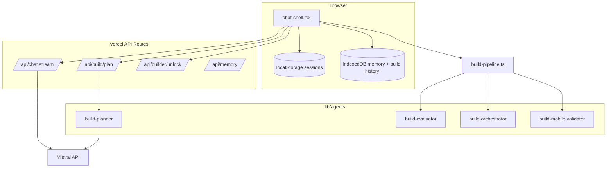
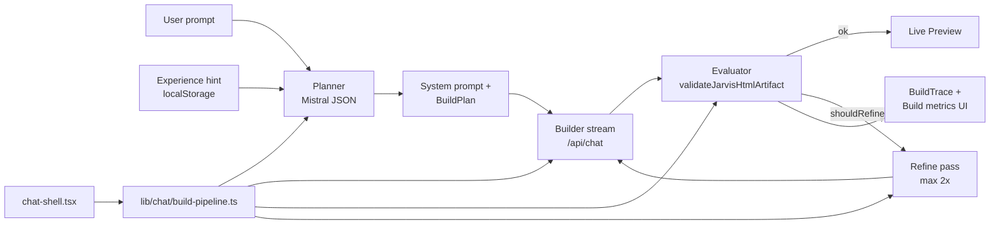

# Jarvis Build Architecture

**Project:** `/Users/erikbabcan/HUB/JARVIS/jarvis-chat-main`  
**Production:** https://jarvis-ten-omega.vercel.app/chat  
**GitHub:** https://github.com/youh4ck3dme/jarvis-chat-main  
**Model:** `mistral/mistral-small-latest` via `MISTRAL_API_KEY`

---

## System overview



---

## Build pipeline



### Chat orchestration layer

`lib/chat/build-pipeline.ts` — pure build flow (no React):

- `runBuildPipeline()` — planner → stream → evaluate → refine (max 2×)
- Injectable hooks: `fetchPlan`, `streamReply`, `onRefinementRound`, `onRoundComplete`
- `buildIncompleteHtmlError()` — user-facing SK message when HTML stays incomplete

`components/chat/chat-shell.tsx` — UI: streaming, sessions, memory, history, preview.

---

## Chat vs Builder modes

| Režim | Default | Správanie |
|-------|---------|-----------|
| **Chat** | ✅ | Konverzácia, žiadny auto-build HTML |
| **Builder** | Po unlock | Planner + stream + preview pipeline |

**Unlock:** `POST /api/builder/unlock` + server `BUILDER_UNLOCK_PASSWORD`.  
Client: `lib/chat/builder-unlock-client.ts` — žiadne heslo v bundle.

**Build intent v Chat:** `detectBuildIntent()` → ak locked, password dialog + `pendingBuildPromptRef` → po unlock resume bez duplicitnej správy (`resumeAfterUnlockRef`).

---

## Story → Build handoff

`lib/chat/jarvis-story.ts`:

| Beat | Trigger |
|------|---------|
| Opening quote | Empty state |
| 45s nudge | Chat mode idle |
| Build intent | «rozložím v hlave…» |
| Plan ready | «Teraz kódujem…» |
| Build success | «Hotovo…» |
| Locked hint | Build intent bez unlock |

---

## Multi-session chat

`lib/chat/chat-sessions.ts` — `jarvis-chat-sessions` v localStorage:

```typescript
{ activeSessionId, sessions: [{ id, title, messages, projectName, updatedAt }] }
```

- Migrácia legacy `chat-messages` → prvá session
- `conversationId` = `activeSessionId` (pamäť per session)
- Drawer: Konverzácie (prepínanie, mazanie)

---

## Memory system

| Vrstva | Úložisko | Scope |
|--------|----------|-------|
| Memory entries | IndexedDB `JarvisChatMemory` | Per `conversationId` |
| Session summary UI | `lib/memory/session-memory-summary.ts` | Drawer prehľad |
| Memory panel | `components/chat/memory-panel.tsx` | Detail + filter + delete |
| Build history | IndexedDB `JarvisBuildHistory` | **Globálna** (max 50) |
| Build experience | localStorage | Posledných 10 evaluácií |

---

## Mobile (iPhone 17 Air)

**Viewport:** 420×912 CSS px, 3× DPR, `viewport-fit: cover`

| Správanie | Implementácia |
|-----------|---------------|
| Single panel chat/artifact | `workspaceView` state |
| Auto artifact počas buildu | `isBuildActive` → `setWorkspaceView("artifact")` |
| Footer Preview/Code počas plannera | `showArtifactWorkspace` prop |
| Touch 44px | header, footer, mode control |
| HTML mobile validate | `build-mobile-validator.ts` v refine |

**Testy:**

```bash
pnpm test:iphone          # Vitest
pnpm test:e2e:iphone      # Playwright (8 tests)
pnpm test:all
```

---

## API routes

| Route | Method | Response |
|-------|--------|----------|
| `/api/chat` | POST | text stream (success), JSON error |
| `/api/build/plan` | POST | `{ success, data: PlannerResult }` |
| `/api/builder/unlock` | POST | `{ success, data: { unlocked: true } }` |
| `/api/memory` | GET/POST/DELETE | Memory CRUD |

Envelope: `lib/api-response.ts`

---

## Environment

Detail: [environment.md](./environment.md)

| Premenná | Povinné prod | Poznámka |
|----------|--------------|----------|
| `MISTRAL_API_KEY` | ✅ | Planner + stream |
| `BUILDER_UNLOCK_PASSWORD` | ✅ | Server only |
| `DEFAULT_AI_MODEL` | odporúčané | |
| `NEXT_PUBLIC_*` password | ❌ | Nikdy |

---

## Phases reference

| Phase | Module |
|-------|--------|
| Orchestrate | `lib/chat/build-pipeline.ts` |
| Plan | `lib/agents/build-planner.ts` |
| Stream | `app/api/chat/route.ts` |
| Validate | `lib/agents/build-evaluator.ts` |
| Refine | `lib/agents/build-orchestrator.ts` |
| Mobile check | `lib/agents/build-mobile-validator.ts` |
| Preview | `copied-from-visual-html/` |

---

## Key files

```
components/chat/chat-shell.tsx      # Main orchestrator UI
components/workspace/               # Header, footer, telemetry, drawer
lib/chat/
  build-pipeline.ts                 # Pure build flow
  chat-sessions.ts                  # Multi-session storage
  jarvis-mode.ts                    # Chat/Builder mode
  jarvis-story.ts                   # Narrative beats
  builder-unlock-client.ts          # Server unlock fetch
lib/agents/                         # Planner, evaluator, orchestrator
lib/memory/                         # IndexedDB + session summaries
app/api/build/plan/route.ts
app/api/builder/unlock/route.ts
app/api/chat/route.ts
copied-from-visual-html/            # Preview panel + artifacts
e2e/                                # Playwright iPhone tests
tests/responsive/                   # Vitest layout tests
```

---

## Z devmate sme vzali / nevzali

| Vzali | Nevzali |
|-------|---------|
| Zod env, planner, evaluator, refine loop | Postgres, pgvector |
| Telemetry UI, experience hints | executor.ts vector search |
| API envelope pattern | OpenRouter |
| | Supabase Edge Functions |

---

## Diagnostika & ops

- **Audit prompt:** [diagnostic-prompt.md](./diagnostic-prompt.md)
- **Deploy & troubleshoot:** [operations.md](./operations.md)
- **Backlog:** [../todo.md](../todo.md)